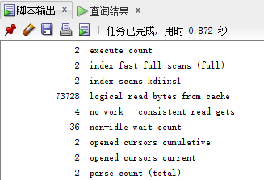
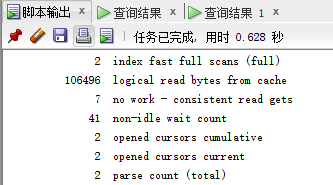

# 实验1：SQL语句的执行计划分析与优化指导

## 实验目的
分析SQL执行计划，执行SQL语句的优化指导。理解分析SQL语句的执行计划的重要作用。

## 实验内容
* 对Oracle12c中的HR人力资源管理系统中的表进行查询与分析。
* 首先运行和分析教材中的样例：本训练任务目的是查询两个部门('IT'和'Sales')的部门总人数和平均工资，以下两个查询的结果是一样的。但效率不相同。
* 设计自己的查询语句，并作相应的分析，查询语句不能太简单。

## 实验过程

### 查询与分析
* 查询1：
```SQL
set autotrace on

SELECT d.department_name,count(e.job_id)as "部门总人数",
avg(e.salary)as "平均工资"
from hr.departments d,hr.employees e
where d.department_id = e.department_id
and d.department_name in ('IT','Sales')
GROUP BY d.department_name;
```

得到查询结果：


查询花费时间：



进行优化指导工具进行优化指导：


* 查询2：
```SQL
set autotrace on

SELECT d.department_name,count(e.job_id)as "部门总人数",
avg(e.salary)as "平均工资"
FROM hr.departments d,hr.employees e
WHERE d.department_id = e.department_id
GROUP BY d.department_name
HAVING d.department_name in ('IT','Sales');
```
得到查询结果：


查询花费时间：



进行优化指导工具进行优化指导：


### 分析和结论：
从优化指导中 可以得出，“查询1”没有使用索引功能，导致查询的速度没有“查询2”的查询速度快，而“查询2”使用了索引。从“脚本输出”得到的结果还可以看出，查询同样的数据，“查询1”的“逻辑读”即logical read只有7万多条，而“查询2”的logical read有10万多条。又查资料得到，逻辑读是从内存中读取数据，而物理读是从磁盘中读取数据，内存的运行速率是大于磁盘的，从而也可以得到“查询2”的执行速率大于“查询1”。

### 设计查询：
我使用了内连接的方式设计查询，即使用了INNER JOIN连接两张表来进行查询：
```SQL
set autotrace on

SELECT hr.departments.department_name,count(hr.employees.job_id)as "部门总人数",
avg(hr.employees.salary)as "平均工资"
from hr.departments INNER JOIN hr.employees ON hr.departments.department_id = hr.employees.department_id
and hr.departments.department_name in ('IT','Sales')
GROUP BY hr.departments.department_name;
```
得到查询结果：


查询花费时间：


进行优化指导工具进行优化指导：


分析：

使用了INNER JOIN内连接，但是反而发现查询语句的执行效率变低了。我自认为是因为将两张表连接成了一张表，使表的数据变得更多了，查询的需要遍历的数据也更加多了，所以导致查询的速度变慢了。

## 实验总结
该次实验是我第一次关于Oracle数据库的实验，感觉有很多东西需要我去学习。但是我发现SQL的编写跟MySQL数据库没有太大的差别，这是非常好，有利于我更加快速的进行Oracle数据库的学习。该次实验是关于查询语句执行效率的实验，对比了几个查询语句后发现语句的编写确实对查询效率有影响，特别是在查询量巨大的时候，不同的查询方式有非常大的区别。