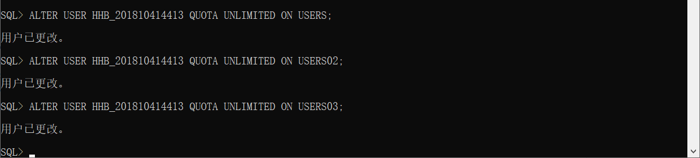
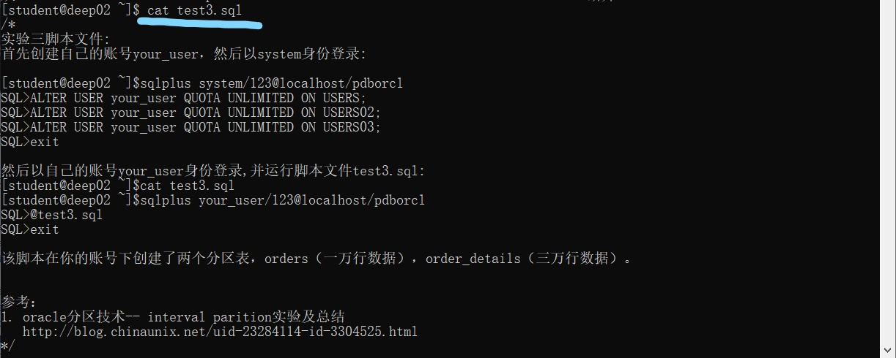
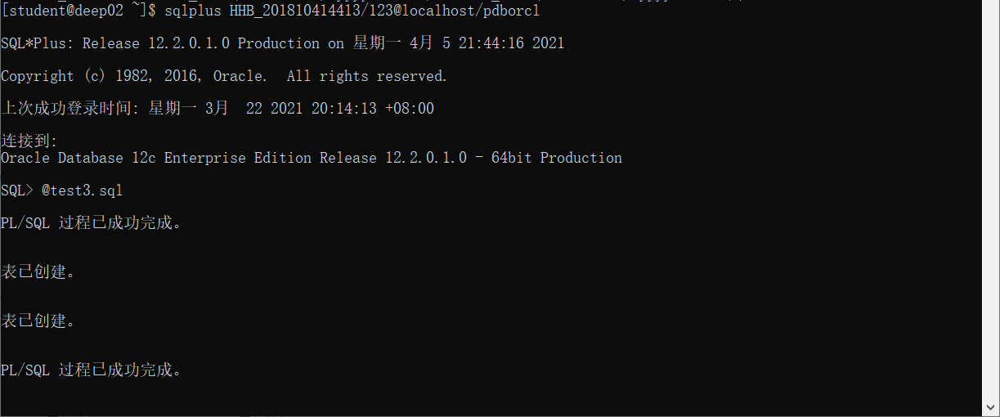
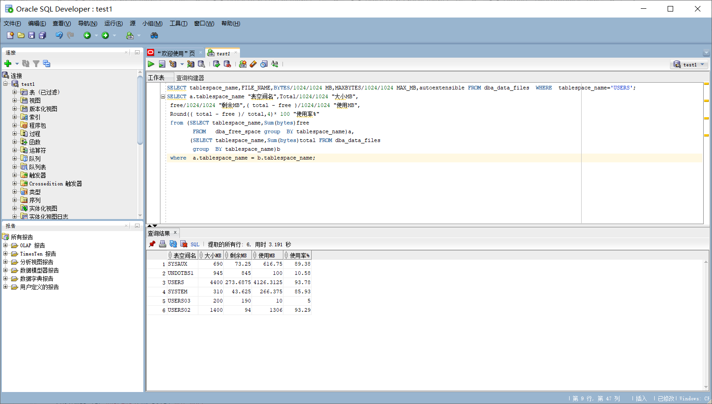

# 实验3：创建分区表

姓名：黄恒博，学号：201810414413
#

##  实验目的

掌握分区表的创建方法，掌握各种分区方式的使用场景。

## 实验内容

* 本实验使用 3 个表空间：USERS,USERS02,USERS03。在表空间中创建两张表：订单表(orders)与订单详表(order_details)。
* 使用你自己的账号创建本实验的表，表创建在上述 3 个分区，自定义分区策略。
* 你需要使用 system 用户给你自己的账号分配上述分区的使用权限。你需要使用 system 用户给你的用户分配可以查询执行计划的权限。
* 表创建成功后，插入数据，数据能并平均分布到各个分区。每个表的数据都应该大于 1 万行，对表进行联合查询。
* 写出插入数据的语句和查询数据的语句，并分析语句的执行计划。
* 进行分区与不分区的对比实验。


## 实验步骤

1.首先创建自己的账号 lqx_user，然后以 system 身份登录: 
```sql
    ALTER USER HHB_201810414413 QUOTA UNLIMITED ON USERS;
    ALTER USER HHB_201810414413 QUOTA UNLIMITED ON USERS02;
    ALTER USER HHB_201810414413 QUOTA UNLIMITED ON USERS03;
```

 

2.用自己的账号HHB_201810414413登录,并运行脚本文件 test3.sql: 
```sql
    cat test3.sql
```

 

```sql
    sqlplus HHB_201810414413/123@localhost/pdborcl
    @test3.sql
```



3.新用户hhb_201810414413连接到pdborcl，创建表mytable和视图myview，插入数据，最后将myview的SELECT对象权限授予hr用户。

## 查看数据库的使用情况
以下样例查看表空间的数据库文件，以及每个文件的磁盘占用情况。



## 实验总结
经过这次实验，我学习到了如何在虚拟机上创建分区表的方法和插入相关数据的语法。明白了在创建分区表之前要先创建好分区存储位置，即分配分区存储空间。然后我还了解了如何在自己的用户下进行数据库和表的相关操作，比如运行sql文件等。最后还学会了怎么去查看数据库的使用情况。