# 基于Oracle的图书馆借阅系统的数据库设计

## 一、概述
随着现代互联网技术的发展，传统行业越来越依赖互联网的高效性和便捷性，其中不乏许多管理系统，图书馆借阅系统就是其中之一。传统的图书馆的借阅是依靠人力和纸张在线下进行实地登记来完成借阅业务，十分的不便，效率也非常的低下，并且会因为人为因素导致许多意想不到的差错。而完全依靠于网络的网络图书馆借阅系统就能大幅度优化这一业务，用快捷的逻辑处理和对数据库的操作就能实现原先需要多个工作人员才能完成的工作，大大节省了人工成本和物资成本。

## 二、需求与功能分析
图书管理系统需要有多个业务需求，例如注册、登录、查询、借阅、还书等。针对该业务需求，我们设计了多张表，用于对用户的注册登录、图书的新增与查询等，还有借阅表和还书表以用于用户对图书进行借阅和还书。用户还分为管理员用户，可以对用户表和图书表进行操作，以完成对整个系统的管理。

## 三、数据库设计

### 1. 添加表空间和用户，以及对用户权限管理
### 2.创建新用户和角色 library_user01和library_user02
oracle中的表就是一张存储数据的表。表空间是逻辑上的划分。方便管理的。

数据表空间 (Tablespace) 

存放数据总是需要空间， Oracle把一个数据库按功能划分若干空间来保存数据。当然数据存放在磁盘最终是以文件形式，所以一盘一个数据表空间包含一个以上的物理文件
数据表。

在仓库，我们可能有多间房子，每个房子又有多个货架，每架又有多层。 我们在数据库中存放数据，最终是数据表的单元来存储与管理的。
数据文件。

以上几个概念都是逻辑上的， 而数据文件则是物理上的。就是说，数据文件是真正“看得着的东西”，它在磁盘上以一个真实的文件体现。

创建表空间：

~~~
格式: create tablespace 表间名 datafile '数据文件名' size 表空间大小
                create tablespace data_test datafile 'e:\oracle\oradata\test\data_1.dbf' size 2000M;
                create tablespace idx_test datafile 'e:\oracle\oradata\test\idx_1.dbf' size 2000M;
                (*数据文件名 包含全路径, 表空间大小 2000M 表是 2000兆) 
~~~

建好tablespace, 就可以建用户

~~~
格式: create user 用户名 identified by 密码 default tablespace 表空间表;
                create user study identified by study default tablespace data_test;
                (*我们创建一个用户名为 study,密码为 study, 缺少表空间为 data_test -这是在第二步建好的.)
                (*缺省表空间表示 用户study今后的数据如果没有专门指出，其数据就保存在 data_test中, 也就是保存在对应的物理文件 e:\oracle\oradata\test\data_1.dbf中)
~~~

创建用户并指定表空间

~~~
CREATE USER cici IDENTIFIED BY cici PROFILE DEFAULT DEFAULT TABLESPACE CICI ACCOUNT UNLOCK;
create user jykl identified by jykl default tablespace jykl_data temporary tablespace jykl_temp;
授权给新用户
GRANT connect, resource TO cici;
grant create session to cici;
~~~

授权给新用户

~~~
  grant connect,resource to study; 
    --表示把 connect,resource权限授予study用户
    grant dba to study;
    --表示把 dba权限授予给 study
~~~

创建数据表

在上面，我们已建好了用户 study 我们现在进入该用户 

sqlplusw study/study@test   然后就可以在用户study中创建数据表了

格式: create table 数据表名 

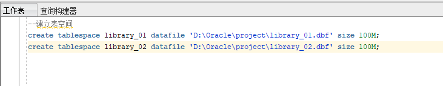

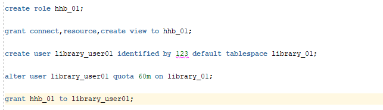

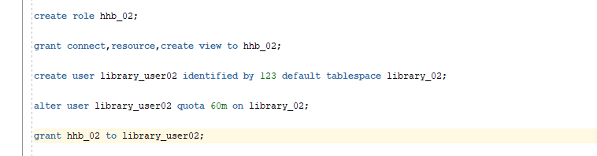

### 3.通过新创建的用户library_user01连接到 pdborcl 

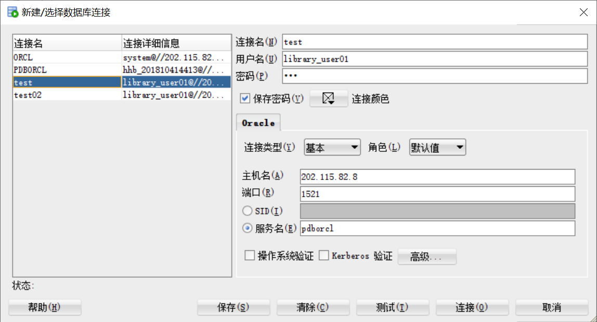

### 4.利用新创建的用户library_user01创建五个表

~~~sql
 CREATE TABLE users(
  user_id number NOT NULL,
  username varchar(20) NOT NULL,
  passwd varchar(20) NOT NULL,
  uname varchar(20) NOT NULL,
  sex varchar(5) NOT NULL,
  book_quota number NOT NULL,
  overdue_num number NOT NULL,
  PRIMARY KEY (user_id)
);

CREATE TABLE admin  (
  admin_id number NOT NULL,
  username varchar(16) NOT NULL,
  passwd varchar(16) NOT NULL,
  uname varchar(16) NOT NULL,
  sex varchar(5) NOT NULL,
  book_quota number NOT NULL,
  overdue_num number NOT NULL,
  PRIMARY KEY (admin_id)
);

CREATE TABLE book(
  book_id number NOT NULL,
  ISBN varchar(20) UNIQUE NOT NULL,
  book_name varchar(50) NOT NULL,
  author varchar(50) NOT NULL,
  publishing_house varchar(50) NOT NULL,
  surplus number NOT NULL,
  PRIMARY KEY (book_id)
);

CREATE TABLE borrow_record(
  borrow_books_record_id number NOT NULL,
  user_id number NOT NULL,
  ISBN varchar(50) NOT NULL,
  lend_time date NOT NULL,
  lend_days number NOT NULL,
  PRIMARY KEY (borrow_books_record_id),
  CONSTRAINT user_id FOREIGN KEY (user_id) REFERENCES users (user_id),
  CONSTRAINT ISBN FOREIGN KEY (ISBN) REFERENCES book (ISBN)
);

CREATE TABLE return_record(
  id number NOT NULL,
  borrow_books_record_id number NOT NULL,
  return_time date NOT NULL,
  is_overdue varchar(5) NOT NULL,
  PRIMARY KEY (id),
  CONSTRAINT borrow_books_record_id FOREIGN KEY (borrow_books_record_id) REFERENCES borrow_record (borrow_books_record_id)
)
~~~

创建结果：

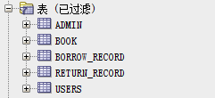

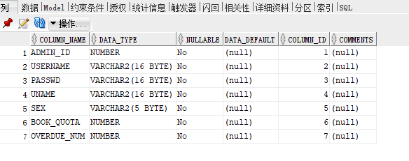

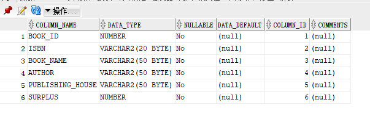

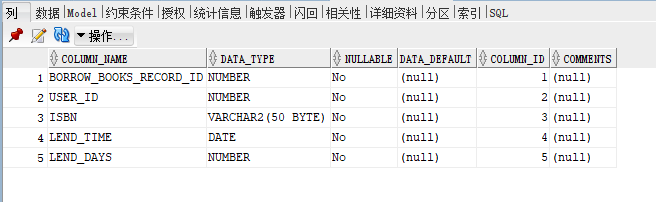

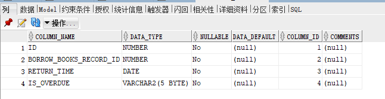

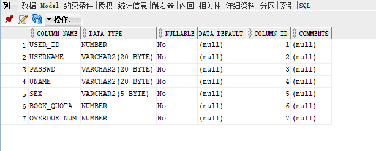

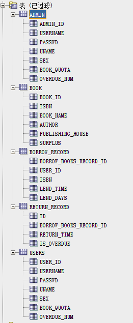

### 5. 创建视图

- 视图(view)，也称虚表, 不占用物理空间，这个也是相对概念，因为视图本身的定义语句还是要存储在数据字典里的。视图只有逻辑定义。每次使用的时候,只是重新执行SQL。

- 视图是从一个或多个实际表中获得的，这些表的数据存放在数据库中。那些用于产生视图的表叫做该视图的基表。一个视图也可以从另一个视图中产生。

- 视图的定义存在数据库中，与此定义相关的数据并没有再存一份于数据库中。通过视图看到的数据存放在基表中。

- 视图看上去非常象数据库的物理表，对它的操作同任何其它的表一样。当通过视图修改数据时，实际上是在改变基表中的数据；相反地，基表数据的改变也会自动反映在由基表产生的视图中。由于逻辑上的原因，有些Oracle视图可以修改对应的基表，有些则不能（仅仅能查询）。

- 还有一种视图：物化视图（MATERIALIZED VIEW ），也称实体化视图，快照 （8i 以前的说法） ，它是含有数据的，占用存储空间。

~~~sql
 CREATE OR REPLACE FORCE EDITIONABLE VIEW "LIBRARY_USER01"."MYVIEW_USER " ("ID") AS 
  SELECT id FROM users;
  
CREATE OR REPLACE FORCE EDITIONABLE VIEW "LIBRARY_USER01"."MYVIEW_ADMIN " ("ID") AS 
  SELECT name FROM admin;
  
CREATE OR REPLACE FORCE EDITIONABLE VIEW "LIBRARY_USER01"."MYVIEW_BOOK " ("ID") AS 
  SELECT name FROM book;
  
  CREATE OR REPLACE FORCE EDITIONABLE VIEW "LIBRARY_USER01"."MYVIEW_BORROW_RECORD" ("ID") AS 
  SELECT name FROM borrow_record;
  
  CREATE OR REPLACE FORCE EDITIONABLE VIEW "LIBRARY_USER01"."MYVIEW_RETURN_RECORD" ("ID") AS 
  SELECT name FROM return_record;
~~~

### 将五个表的视图的SELECT对象权限授予library_user01用户 

~~~sql
GRANT SELECT ON myview_USER TO library_user01;
GRANT SELECT ON myview_ADMIN TO library_user01;
GRANT SELECT ON myview_BOOK TO library_user01;
GRANT SELECT ON myview_BORROW_RECORD TO library_user01;
GRANT SELECT ON myview_RETURN_RECORD TO library_user01;
~~~

### 6. 向数据库中写入数据共计50000多个数据
#### 6.1 用户信息表
~~~sql
begin
    for i in 1..10000
        loop
        insert into users(user_id,username,passwd,uname,sex,book_quota,overdue_num)
        values(i,'testuser','000','测试人员','男',3,0);
        end loop;
        commit;
end;
~~~

#### 6.2 图书信息表
~~~sql
begin
    for i in 1..5000
        loop
            insert into book(book_id,isbn,book_name,author,publishing_house,surplus)
            values(i,to_char(SEQ_NEWISBNS.nextval),'三体','刘慈欣','新华出版社','5');
        end loop;
        commit;
end;
~~~

### 7创建函数
#### 查询所有用户的数量

~~~sql
create or replace PACKAGE MyPack IS
 
  FUNCTION Get_AllUser(V_DEPARTMENT_ID NUMBER) RETURN NUMBER;
  
 END MyPack;
 
 FUNCTION Get_AllUser(V_DEPARTMENT_ID NUMBER) RETURN NUMBER
  AS
   N NUMBER(20,2);
   BEGIN
    SELECT SUM(users.user_id) into N FROM users;
    RETURN N;
   END;
 END MyPack;
~~~
结果：

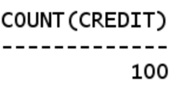

### 8. 数据库备份

**ORACLE数据库备份与恢复详解**

Oracle的备份与恢复有三种标准的模式，大致分为两 大类，备份恢复(物理上的)以及导入导出(逻辑上的)，而备份恢复又可以根据数据库的工作模式分为非归档模式(Nonarchivelog-style) 和归档模式(Archivelog-style),通常，我们把非归档模式称为冷备份，而相应的把归档模式称为热备份。

### 热备份和冷备份优缺点

#### 热备份的优点是：

 1．可在表空间或数据文件级备份，备份时间短。 

 2．备份时数据库仍可使用。 

 3．可达到秒级恢复（恢复到某一时间点上）。 

 4．可对几乎所有数据库实体作恢复。 

 5．恢复是快速的，在大多数情况下在数据库仍工作时恢复。 

#### 热备份的不足是：

 1．不能出错，否则后果严重。 

 2．若热备份不成功，所得结果不可用于时间点的恢复。 

 3．因难维护，所以要特别仔细小心，不允许“以失败而告终”。 

#### 冷备份的优点是：

 1．是非常快速的备份方法（只需拷贝文件） 

 2．容易归档（简单拷贝即可） 

 3．容易恢复到某个时间点上（只需将文件再拷贝回去） 

 4．能与归档方法相结合，作数据库“最新状态”的恢复。 

 5．低度维护，高度安全。 

#### 冷备份不足是：

 1．单独使用时，只能提供到“某一时间点上”的恢复。 

 2．在实施备份的全过程中，数据库必须要作备份而不能作其它工作。也就是说，数据库必须是关闭状态。

 3．若磁盘空间有限，只能拷贝到磁带等其它外部存储设备上，速度会很慢。 

 4．不能按表或按用户恢复。

### 物理备份之冷备份：

   当数据库可以暂时处于关闭状态时，我们需要将它在这一稳定时刻的数据相关文件转移到安全的区域，当数据库遭到破坏，再从安全区域将备份的数据库相关文件拷 贝回原来的位置，这样，就完成了一次快捷安全等数据转移。由于是在数据库不提供服务的关闭状态，所以称为冷备份。冷备份具有很多优良特性，比如上面图中我 们提到的，快速，方便，以及高效。一次完整的冷备份步骤应该是：

   1，首先关闭数据库（shutdown normal）

   2，拷贝相关文件到安全区域（利用操作系统命令拷贝数据库的所有的数据文件、日志文件、控制文件、参数文件、口令文件等（包括路径））

   3，重新启动数据库（startup）

   以上的步骤我们可以用一个脚本来完成操作：

~~~
   su – oracle <   sqlplus /nolog 
   connect / as sysdba
   shutdown immediate;
   !cp 文件  备份位置（所有的日志、数据、控制及参数文件）;
   startup;
   exit;
~~~

   这样，我们就完成了一次冷备份，请确定你对这些相应的目录（包括写入的目标文件夹）有相应的权限。

   恢复的时候，相对比较简单了，我们停掉数据库，将文件拷贝回相应位置，重启数据库就可以了，当然也可以用脚本来完成。

   ### 导出备份：

   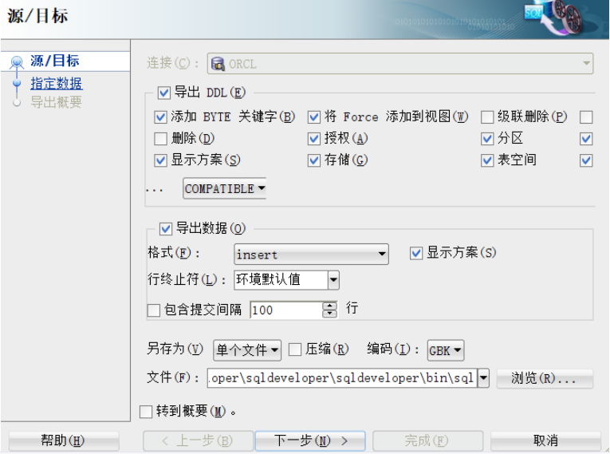